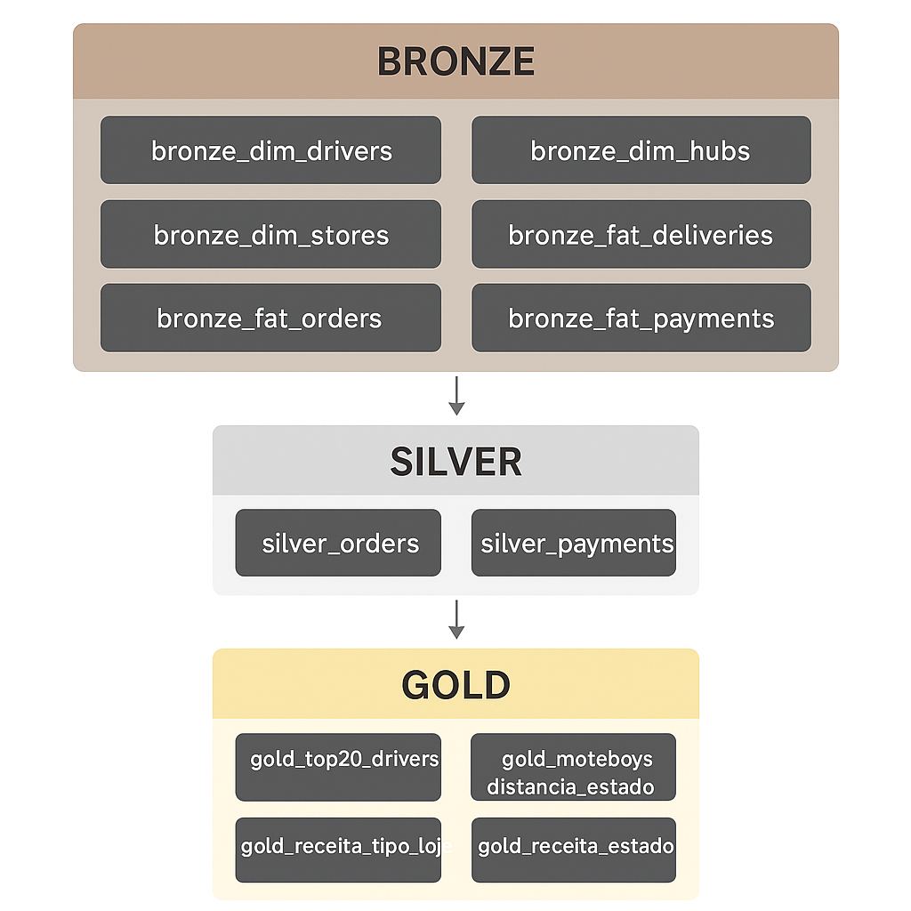
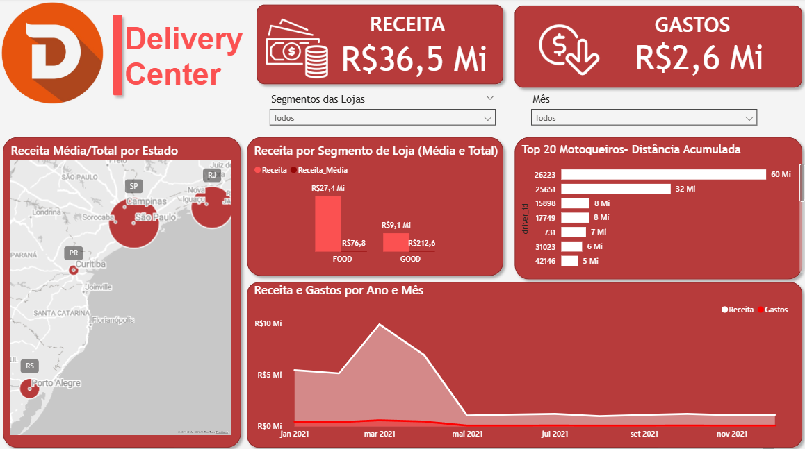

# Estudo de Caso — Projeto de Dados

## 1. Introdução ao Problema

A empresa precisava responder a perguntas estratégicas de diferentes áreas:

* **CFO**: Qual a receita média e total separada por tipo de loja (Food x Good)?
* **CFO**: Qual a receita média e total por estado?
* **Marketing**: Quais os 20 entregadores que mais percorreram distância total para bonificação?
* **Pricing**: Qual a distribuição da distância média percorrida pelos motoboys por estado?

Essas questões exigiam organização e tratamento dos dados para garantir análises consistentes e de fácil consumo pela diretoria.

---

## 2. Subida dos Dados

Os dados foram disponibilizados inicialmente em arquivos brutos.
Eles foram **subidos para o banco de dados via Python**, garantindo que cada tabela ficasse disponível de forma padronizada, permitindo as etapas seguintes da arquitetura de dados.

---

## 3. Arquitetura Medalhão

Foi utilizada a arquitetura **Medalhão (Bronze → Silver → Golden)**, que organiza os dados em camadas:

* **Bronze**: Tabelas brutas, representando a extração inicial dos dados (dim_drivers, dim_hubs, dim_stores, fat_orders, fat_deliveries, fat_payments).
* **Silver**: Tabelas refinadas, com normalizações, limpeza de colunas e junções básicas para enriquecer os dados (ex: silver_orders, silver_deliveries, silver_lojas, silver_payments).
* **Golden**: Camada final, onde são criadas tabelas e visões diretamente relacionadas às perguntas de negócio, como:

  * Receita média e total por segmento de loja.
  * Receita média e total por estado.
  * Ranking dos 20 entregadores com maior distância percorrida.
  * Distância média percorrida por motoboys em cada estado.

Essa arquitetura garantiu clareza, escalabilidade e facilidade de manutenção.

---

## 4. Criação do Dashboard (Power BI)

Um dashboard foi desenvolvido no **Power BI**, com o objetivo principal de **acompanhar os dados das perguntas feitas pelos executivos e times da empresa**.

O dashboard foi dividido em **páginas temáticas**:

* **Página CFO**: Receita média e total por segmento e por estado.
* **Página Marketing**: Ranking dos 20 entregadores com maior distância percorrida.
* **Página Pricing**: Distribuição da distância média percorrida por motoboys em cada estado.

Essa estrutura facilitou a navegação e permitiu que cada área tivesse uma visão clara de suas métricas-chave.

O link para o Dashboard: [Link Dashboard](https://app.powerbi.com/view?r=eyJrIjoiNmQzMzUzZDctYzNkNC00YTg1LWFmNzItZmY1MmVjZGM3YjJkIiwidCI6IjlkYmYzMjZlLTIxODUtNGM3OC1iY2NhLTBmNTdmOTc4ZjNkYSJ9)

---

## 5. Importância do Projeto

Este projeto demonstrou:

* A relevância de organizar dados em uma arquitetura estruturada (Medalhão) para garantir qualidade e rastreabilidade.
* Como os dados podem ser transformados em **insights acionáveis**, auxiliando decisões estratégicas de diferentes áreas.
* A utilidade de dashboards interativos para **democratizar o acesso às informações**, permitindo que executivos e gestores explorem os indicadores de forma dinâmica.

Em resumo, a iniciativa fortaleceu a cultura de dados da empresa, mostrou o impacto direto da análise de dados no negócio e criou bases sólidas para futuras análises.
